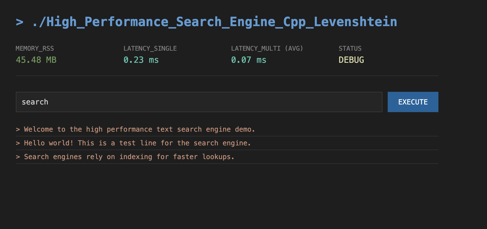

# High Performance C++ Search Engine (Levenshtein Distance)

Hey there! 👋 This is a high-performance text search engine I built using C++ and Node.js.

I wanted to create something that wasn't just fast, but also smart enough to handle typos. So, I implemented a **Trie data structure** combined with the **Levenshtein Distance** algorithm (for fuzzy matching) in C++. To make it usable on the web, I wrapped the C++ core in a Node.js addon using `node-addon-api`.

It's designed to be a raw, developer-focused tool—no fancy marketing fluff, just performance metrics and results.



## What's Under the Hood?

*   **Core Logic (C++):**
    *   **Trie & Inverted Index:** I use a Trie to store the vocabulary for fast prefix lookups and an Inverted Index to map words to line numbers instantly.
    *   **Memory Optimization:** I recently optimized the Trie nodes to use `std::vector` instead of `std::unordered_map` for children storage, which significantly reduced memory overhead (checked via ASan).
    *   **Fuzzy Search:** Uses a recursive Levenshtein algorithm on the Trie to find words within an edit distance of 2 (so "hello" matches "helo" or "hallo").

*   **Web Interface (Node.js):**
    *   **N-API:** The C++ code is compiled as a native Node.js addon.
    *   **Real-time Monitoring:** The UI shows live stats like Memory Usage (RSS), Single-Thread Latency, and Multi-Thread Throughput.
    *   **Terminal UI:** I styled the frontend to look like a VS Code terminal because... well, I like it.

## How to Run It

1.  **Build the C++ Addon:**
    ```bash
    npm install
    npm run build
    ```

2.  **Start the Server:**
    ```bash
    npm start
    ```
    Open `http://localhost:3000` in your browser.

3.  **Debug & Benchmark Mode:**
    If you want to see the memory usage and stress test it:
    ```bash
    ./scripts/advanced_debug.sh
    ```
    This recompiles with AddressSanitizer and launches a background monitor.

## Project Structure

```text
.
├── src/                  # C++ Source Code
│   ├── SearchEngine.cpp  # The core logic (Trie + Levenshtein)
│   └── addon.cpp         # Node.js bindings
├── public/               # Frontend (Terminal UI)
├── scripts/              # Debug & Benchmark scripts
├── binding.gyp           # Build configuration
└── server.js             # Express server
```

## Why I Built This

I wanted to experiment with **Hybrid Architectures**—using C++ for the heavy lifting and Node.js for the glue. It was a fun challenge to optimize the memory footprint of the Trie and see the latency drop in real-time on the dashboard.

Feel free to poke around the code!

---
*Built with ☕ and C++*
