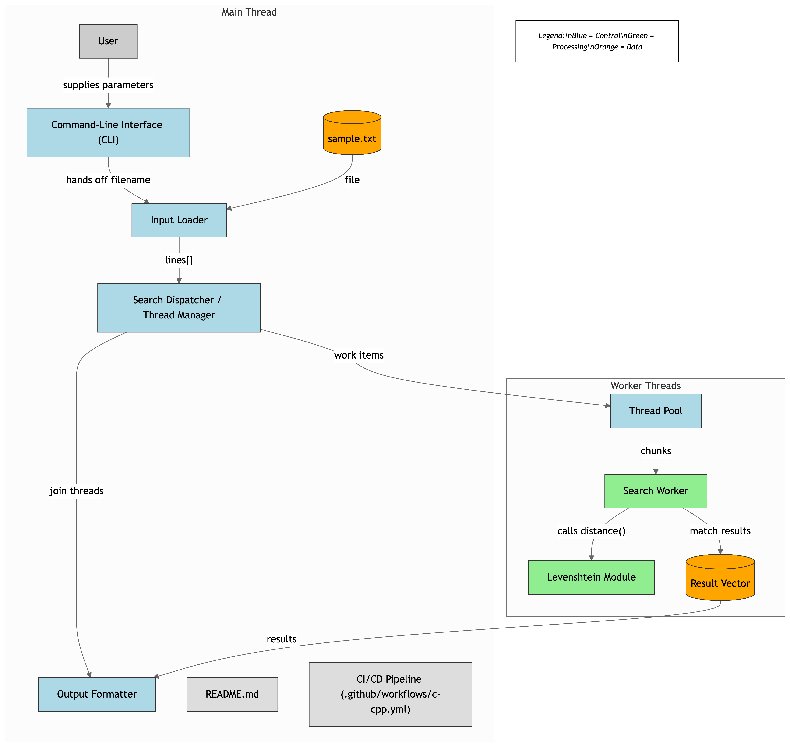

# Text Search with Fuzzy Matching (Levenshtein Distance)

## Description

This program performs a parallel search for a keyword in a text file. It can find exact matches and fuzzy matches using the Levenshtein distance (edit distance) for keyword similarity. The program can handle large files efficiently by using multiple threads for concurrent searching. It also ensures thread safety while adding results, preventing duplicate entries from being output. This tool is particularly useful when you need to search for a keyword that may have slight variations (e.g., typos or spelling differences).

## Features

- **Parallel Search**: Utilizes multiple threads to speed up the search process, making it ideal for large files.
- **Fuzzy Matching**: Supports fuzzy search using Levenshtein distance for inexact matches, allowing you to find keywords even with small errors.
- **Thread Safety**: Ensures that multiple threads can safely add results to the shared resource (results vector) without causing data races.
- **Efficient Result Handling**: Avoids duplicate entries in the results by checking each line for uniqueness, ensuring only unique matches are displayed.

## Requirements

- **C++11 or later**: The program is written using C++11 features for better efficiency and parallelism.
- **g++ Compiler**: You need the `g++` compiler to compile the program. Ensure that it supports C++11 or later and that it has threading capabilities enabled.

## Working


## Compilation

To compile the program, use the following command:

```bash
g++ -std=c++11 or uese C++17 -o textSearch textSearch.cpp -pthread

run the file with the word you need to search

─ ./textSearch sample.txt "Hello world" 4  

```


## Output
```bash
Running multi-threaded search...
Line 3: Hello world, how are you?
Line 45: Hella word, hwo are you?

Multi-threaded search took: 0.0189 seconds.

Running single-threaded search with 4 threads...
Line 3: Hello world, how are you?
Line 45: Hella word, hwo are you?

Single-threaded search took: 0.0315 seconds.

```

```bash
Mode	                                  Time Taken
Single Thread	                          ~0.03 sec
Multi Thread (4)                          ~0.01 sec

```

```bash
.
├── main.cpp        
├── sample.txt     
└── README.md        

```

```bash
MIT License

Copyright (c) 2024 Durgesh Tiwari

Permission is hereby granted, free of charge, to any person obtaining a copy
of this software and associated documentation files (the "Software"), to deal
in the Software without restriction, including without limitation the rights
to use, copy, modify, merge, publish, distribute, sublicense, and/or sell    
copies of the Software, and to permit persons to whom the Software is        
furnished to do so, subject to the following conditions:                     

The above copyright notice and this permission notice shall be included in   
all copies or substantial portions of the Software.                          

THE SOFTWARE IS PROVIDED "AS IS", WITHOUT WARRANTY OF ANY KIND, EXPRESS OR   
IMPLIED, INCLUDING BUT NOT LIMITED TO THE WARRANTIES OF MERCHANTABILITY,     
FITNESS FOR A PARTICULAR PURPOSE AND NONINFRINGEMENT. IN NO EVENT SHALL THE  
AUTHORS OR COPYRIGHT HOLDERS BE LIABLE FOR ANY CLAIM, DAMAGES OR OTHER       
LIABILITY, WHETHER IN AN ACTION OF CONTRACT, TORT OR OTHERWISE, ARISING      
FROM, OUT OF OR IN CONNECTION WITH THE SOFTWARE OR THE USE OR OTHER DEALINGS 
IN THE SOFTWARE.

```


## Author

**Durgesh Tiwari**  
📧 Email: [durgeshse98@gmail.com](mailto:durgeshse98@gmail.com)  
🔗 [LinkedIn](https://www.linkedin.com/in/durgesh98)  
💻 [GitHub](https://github.com/blackhat955)


